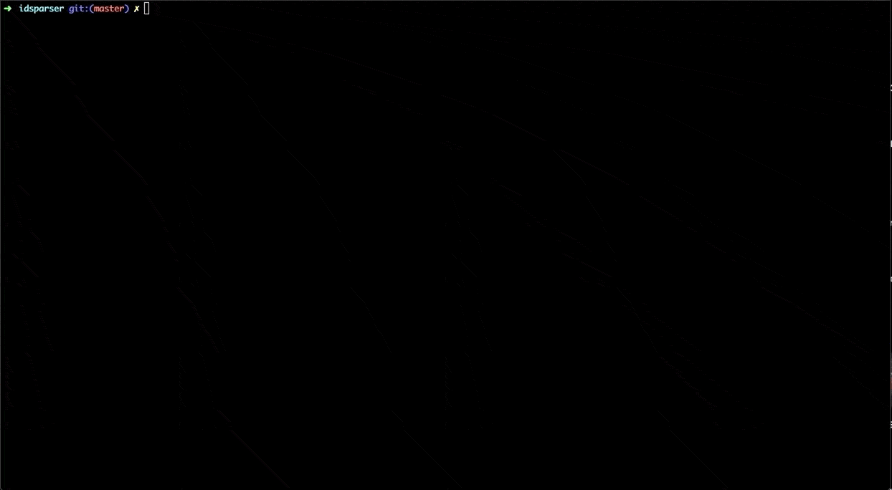

# idsparser

idsparser is a CLI based python tool for interactively enabling and disabling Snort based IDS rules. 

In short, idsparser offers the following key features:
* Passing a single rule file (community rules), or a directory of rule files (subscriber based rules).
* Passing a CSV (click [here](example_files/applications.csv){:target="_blank"} for formatting) of application names. Any rules containing the app name will be enabled.
* Passing a CSV (click [here](example_files/vulnerabilities.csv){:target="_blank"} for formatting) of CVE names. Any rules containing references to these CVEs will be enabled.
* Through a multi-selection menu, allows the user to enable rules of a particular classtype e.g. trojan-activity, etc

Once finished, idsparser will then ouput the newly modified ruleset into a file organised into clear enabled/disabled sections, as well as identifying at the top which classtypes were chosen by the user. If the output file was not specified, then the original source file will be appended with '.old' and the output file taking on the formers name.

Additionally, a dashboard of statistics on the rule file are shown for a clear understanding of what is happening during the process.

### Demo



## Usage

### Installation

```bash
$ git clone git@github.com:Kane-Ryans/idsparser.git
```

### Launching

```bash
$ cd idsparser/
$ python3 -m idsparser
```

## Roadmap

* Improve the flow and visual of the menu/dashboard

* Add the ability for a user to search for specific rules once the rule files have been loaded, and then to toggle between enabled/disable.

* If the src is a directory of rules (typically with subscriber based rule sets) then output the results in a similar fashion, so that large amount of rules are not contained in the same rule file.

* Add functionality for Suricata based rules.

## Contributing

The idsparser was created as a project for my portfolio of work. Anybody who wishes to fork the repo and continue adding features/further development are more than welcome.

## License

MIT License

Copyright (c) 2020 Kane Ryans

Permission is hereby granted, free of charge, to any person obtaining a copy
of this software and associated documentation files (the "Software"), to deal
in the Software without restriction, including without limitation the rights
to use, copy, modify, merge, publish, distribute, sublicense, and/or sell
copies of the Software, and to permit persons to whom the Software is
furnished to do so, subject to the following conditions:

The above copyright notice and this permission notice shall be included in all
copies or substantial portions of the Software.

THE SOFTWARE IS PROVIDED "AS IS", WITHOUT WARRANTY OF ANY KIND, EXPRESS OR
IMPLIED, INCLUDING BUT NOT LIMITED TO THE WARRANTIES OF MERCHANTABILITY,
FITNESS FOR A PARTICULAR PURPOSE AND NONINFRINGEMENT. IN NO EVENT SHALL THE
AUTHORS OR COPYRIGHT HOLDERS BE LIABLE FOR ANY CLAIM, DAMAGES OR OTHER
LIABILITY, WHETHER IN AN ACTION OF CONTRACT, TORT OR OTHERWISE, ARISING FROM,
OUT OF OR IN CONNECTION WITH THE SOFTWARE OR THE USE OR OTHER DEALINGS IN THE
SOFTWARE.
